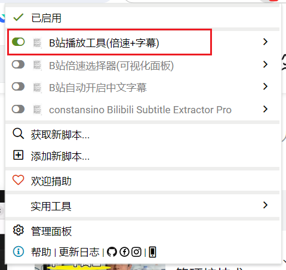
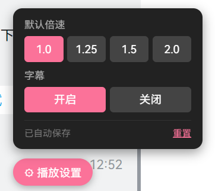

# Bilibili Player Tools
[](https://www.tampermonkey.net/)
[]()

## 简介 | Introduction
适用于 **Bilibili（哔哩哔哩）** 的油猴(Tampermonkey)脚本，基于模拟页面点击实现功能，把**倍速**和**字幕**开关合并到一个悬浮面板里，设置一次，所有视频都按你的偏好执行。

A Tampermonkey userscript for Bilibili. Combines playback speed and Chinese subtitle toggle into a single floating panel — set once, applies to all videos automatically.

## 痛点 | Problem
观看分P学习视频时，每次切集都要：
- 手动打开倍速菜单 → 选倍速
- 手动打开字幕菜单 → 选中文字幕 → 关闭

操作重复且打断思路，关闭扩展又要刷新页面才能恢复默认。

## 功能 | Features

### 一站式悬浮面板
- 右下角 `⚙ 播放设置` 悬浮按钮，可**拖动到任意位置**（位置自动记忆）
- 点击展开面板，点空白处自动关闭
- 选中即生效，设置自动保存到 `localStorage`

### 默认倍速 | Default Playback Speed
- 档位：`1.0x` / `1.25x` / `1.5x` / `2.0x`
- 选择后切换分集/视频自动沿用

### 中文字幕 | Auto Chinese Subtitle
- 一键开启 AI 中文字幕（`data-lan="ai-zh"`）
- 一键关闭原声字幕 + 翻译字幕（点对应关闭开关）
- 仅模拟点击，不修改 B 站内部状态
- 实时生效，无需刷新

### 智能跟随
- 首次进入页面：2 秒后自动应用
- 切换分P：检测 URL 变化后自动应用


## 文件说明 | File List
```
bilibili-player-tools/
├── playback-speed-selector.user.js  # 合并脚本(倍速+字幕)
├── CHANGELOG.md                     # 更新日志
├── LICENSE                          # 开源协议
├── README.md                        # 项目说明
└── imgs/
    ├── image.png                    # 面板效果截图
    └── image1.png                   # 安装教程截图
```

## 使用教程 | Usage

### 前置要求 | Prerequisite
1. 浏览器安装 **Tampermonkey** 扩展
   - Chrome / Edge / Firefox 均可在官方应用商店搜索安装

### 安装脚本 | Install
1. 打开 Tampermonkey，点击 **添加新脚本**
2. 将 `playback-speed-selector.user.js` 的完整代码粘贴到编辑区
3. 按下 `Ctrl + S` 保存，脚本自动启用
4. 打开任意 B 站视频页面，**右下角出现 `⚙ 播放设置` 按钮即生效**





### 操作说明 | How to Use
| 操作 | 效果 |
| --- | --- |
| **单击** `⚙ 播放设置` | 展开/收起设置面板 |
| **拖动** `⚙ 播放设置` | 把按钮拖到屏幕任意位置（自动记忆） |
| **点空白处** | 关闭设置面板 |
| **选择倍速** | 立即生效并保存，切换视频自动沿用 |
| **字幕 → 开启** | 自动打开 AI 中文字幕 |
| **字幕 → 关闭** | 自动关闭原声字幕 + 翻译字幕 |
| **重置** | 清空设置，当前视频立即恢复 1.0x + 字幕关闭 |

### 存储键 | Storage Keys
设置保存在 `localStorage`，每个键独立：
- `bili_tool_speed` — 倍速（`1` / `1.25` / `1.5` / `2`）
- `bili_tool_subtitle` — 字幕（`on` / `off`）
- `bili_tool_pos` — 按钮位置（`{x, y}` JSON）

## 工作原理 | How It Works
- 找到 B 站播放器控件按钮（`.bpx-player-ctrl-playbackrate` / `.bpx-player-ctrl-subtitle`）`click()` 打开菜单
- 等菜单渲染（400~600ms）后 `click()` 对应选项
- 关闭字幕时直接点 `.bpx-player-ctrl-subtitle-close-switch`（沿用实测通过的 DOM 路径）
- 全程模拟用户点击，与 B 站内部状态完全解耦

## 更新日志 | Changelog
详见 [CHANGELOG.md](CHANGELOG.md)

## 开源协议 | License
MIT License
